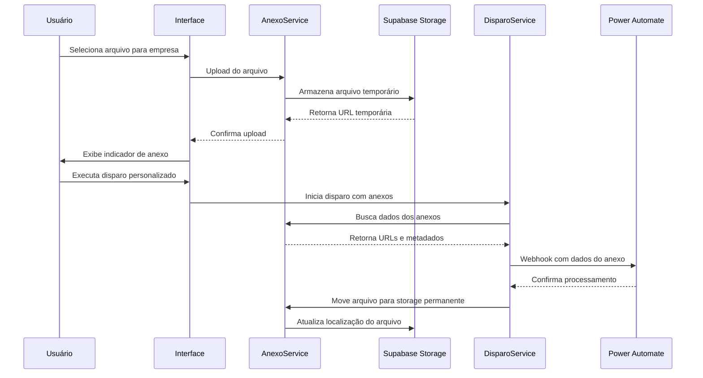

# Documento de Design - Sistema de Anexos para Disparos Personalizados

## Visão Geral

O sistema de anexos será implementado como uma extensão da funcionalidade existente de disparos personalizados, permitindo que empresas com a opção "anexo=true" possam ter arquivos anexados aos seus books durante o processo de disparo. A solução integra com o Power Automate via webhook para processamento dos anexos.

## Arquitetura

### Componentes Principais

1. **Interface de Upload de Anexos** - Componente React para seleção e upload de arquivos
2. **Serviço de Armazenamento** - Gerenciamento de arquivos no Supabase Storage
3. **Extensão do Webhook** - Modificação do payload para incluir dados dos anexos
4. **Controle de Estado** - Rastreamento do status dos anexos durante o processo

### Fluxo de Dados



## Componentes e Interfaces

### 1. Componente AnexoUpload

**Localização:** `src/components/admin/client-books/AnexoUpload.tsx`

```typescript
interface AnexoUploadProps {
  empresaId: string;
  onAnexosChange: (anexos: AnexoData[]) => void;
  disabled?: boolean;
  maxTotalSize?: number; // 25MB por padrão
}

interface AnexoData {
  id: string;
  nome: string;
  tipo: string;
  tamanho: number;
  url: string;
  status: 'pendente' | 'enviando' | 'processado' | 'erro';
}

interface AnexosSummary {
  totalArquivos: number;
  tamanhoTotal: number;
  tamanhoLimite: number;
  podeAdicionar: boolean;
}
```

**Funcionalidades:**
- Upload de múltiplos arquivos via drag-and-drop ou seleção
- Validação de tipo e tamanho individual e total
- Lista de arquivos selecionados com preview
- Controle de limite total de 25MB
- Indicador de progresso e status por arquivo
- Remoção individual de arquivos da lista

### 2. Serviço de Anexos

**Localização:** `src/services/anexoService.ts`

```typescript
class AnexoService {
  async uploadAnexos(empresaId: string, arquivos: File[]): Promise<AnexoData[]>
  async uploadAnexo(empresaId: string, arquivo: File): Promise<AnexoData>
  async removerAnexo(anexoId: string): Promise<void>
  async removerAnexosEmpresa(empresaId: string): Promise<void>
  async obterAnexo(anexoId: string): Promise<AnexoData | null>
  async obterAnexosEmpresa(empresaId: string): Promise<AnexoData[]>
  async validarLimiteTotal(empresaId: string, novosArquivos: File[]): Promise<boolean>
  async calcularTamanhoTotal(empresaId: string): Promise<number>
  async moverParaPermanente(anexoIds: string[]): Promise<void>
  async limparAnexosExpirados(): Promise<void>
}
```

### 3. Extensão do BooksDisparoService

**Modificações em:** `src/services/booksDisparoService.ts`

```typescript
interface DisparoComAnexos {
  empresaId: string;
  clientes: Cliente[];
  emailsCC: string[];
  anexos?: AnexoWebhookData[];
}

interface AnexoWebhookData {
  url: string;
  nome: string;
  tipo: string;
  tamanho: number;
  token: string;
}

interface AnexosSummaryWebhook {
  totalArquivos: number;
  tamanhoTotal: number;
  arquivos: AnexoWebhookData[];
}
```

### 4. Hook de Anexos

**Localização:** `src/hooks/useAnexos.ts`

```typescript
export const useAnexos = () => {
  const uploadAnexos: (empresaId: string, arquivos: File[]) => Promise<AnexoData[]>
  const uploadAnexo: (empresaId: string, arquivo: File) => Promise<AnexoData>
  const removerAnexo: (anexoId: string) => Promise<void>
  const removerTodosAnexos: (empresaId: string) => Promise<void>
  const obterAnexosPorEmpresa: (empresaId: string) => AnexoData[]
  const validarLimiteTotal: (empresaId: string, novosArquivos: File[]) => Promise<boolean>
  const calcularTamanhoAtual: (empresaId: string) => number
  const isUploading: boolean
  const uploadProgress: Record<string, number> // Progress por arquivo
  const error: Error | null
}
```

## Modelos de Dados

### Tabela: anexos_temporarios

```sql
CREATE TABLE anexos_temporarios (
  id UUID PRIMARY KEY DEFAULT gen_random_uuid(),
  empresa_id UUID NOT NULL REFERENCES empresas_clientes(id),
  nome_original VARCHAR(255) NOT NULL,
  nome_arquivo VARCHAR(255) NOT NULL,
  tipo_mime VARCHAR(100) NOT NULL,
  tamanho_bytes INTEGER NOT NULL,
  url_temporaria TEXT NOT NULL,
  url_permanente TEXT,
  status VARCHAR(20) DEFAULT 'pendente',
  token_acesso VARCHAR(255) NOT NULL,
  data_upload TIMESTAMP DEFAULT NOW(),
  data_expiracao TIMESTAMP DEFAULT NOW() + INTERVAL '24 hours',
  data_processamento TIMESTAMP,
  erro_detalhes TEXT,
  created_at TIMESTAMP DEFAULT NOW(),
  updated_at TIMESTAMP DEFAULT NOW()
);
```

### Extensão da Tabela: historico_disparos

```sql
ALTER TABLE historico_disparos 
ADD COLUMN anexo_id UUID REFERENCES anexos_temporarios(id),
ADD COLUMN anexo_processado BOOLEAN DEFAULT FALSE;
```

## Tratamento de Erros

### Tipos de Erro

1. **ErroUploadAnexo** - Falhas no upload (tamanho, tipo, rede)
2. **ErroProcessamentoAnexo** - Falhas no processamento pelo Power Automate
3. **ErroExpiracaoAnexo** - Token ou arquivo expirado
4. **ErroArmazenamento** - Falhas no Supabase Storage

### Estratégias de Recuperação

- **Retry automático** para falhas de rede (3 tentativas)
- **Fallback para envio sem anexo** em caso de falha crítica
- **Limpeza automática** de arquivos expirados
- **Notificação ao usuário** sobre falhas de processamento

## Estratégia de Testes

### Testes Unitários

1. **AnexoService** - Upload, validação, limpeza
2. **AnexoUpload Component** - Interações do usuário
3. **Webhook Integration** - Payload e processamento

### Testes de Integração

1. **Fluxo completo** - Upload → Disparo → Processamento
2. **Cenários de falha** - Arquivos corrompidos, timeouts
3. **Limpeza automática** - Expiração de arquivos

### Testes E2E

1. **Disparo com anexo** - Fluxo completo do usuário
2. **Múltiplos anexos** - Várias empresas simultaneamente
3. **Recuperação de falhas** - Reenvio após erro

## Configuração do Power Automate

### Estrutura do Webhook Estendido

```json
{
  "empresa": {
    "id": "uuid",
    "nome": "Nome da Empresa",
    "email_gestor": "gestor@empresa.com"
  },
  "clientes": [
    {
      "id": "uuid",
      "nome": "Nome do Cliente",
      "email": "cliente@empresa.com"
    }
  ],
  "template": {
    "id": "uuid",
    "nome": "Template Personalizado",
    "conteudo": "HTML do template"
  },
  "anexos": {
    "totalArquivos": 2,
    "tamanhoTotal": 2097152,
    "arquivos": [
      {
        "url": "https://storage.supabase.co/anexos/temp/relatorio.pdf",
        "nome": "Relatório Mensal.pdf",
        "tipo": "application/pdf",
        "tamanho": 1048576,
        "token": "jwt-token-para-autenticacao-1"
      },
      {
        "url": "https://storage.supabase.co/anexos/temp/planilha.xlsx",
        "nome": "Dados Complementares.xlsx",
        "tipo": "application/vnd.openxmlformats-officedocument.spreadsheetml.sheet",
        "tamanho": 1048576,
        "token": "jwt-token-para-autenticacao-2"
      }
    ]
  },
  "metadados": {
    "mes_referencia": "2025-09",
    "data_disparo": "2025-10-01T10:00:00Z"
  }
}
```

### Fluxo no Power Automate

1. **Receber Webhook** - Capturar dados do disparo
2. **Validar Anexos** - Verificar se campo anexos existe e tem arquivos
3. **Download dos Arquivos** - Loop para baixar cada arquivo usando URL e token
4. **Processar Template** - Aplicar variáveis ao HTML
5. **Enviar E-mail** - Incluir todos os anexos no e-mail
6. **Confirmar Processamento** - Retornar status para o sistema com detalhes de cada anexo

### Configuração de Autenticação

- **Token JWT** com expiração de 1 hora
- **Validação de origem** via IP whitelist
- **Rate limiting** para prevenir abuso

## Considerações de Segurança

### Validação de Arquivos

- **Whitelist de tipos MIME** permitidos
- **Verificação de assinatura** (magic numbers)
- **Limite de tamanho** por arquivo (10MB individual)
- **Limite de tamanho total** por empresa (25MB)
- **Máximo de arquivos** por empresa (10 arquivos)
- **Scan de malware** (se disponível)

### Controle de Acesso

- **URLs temporárias** com expiração
- **Tokens de acesso** únicos por arquivo
- **Validação de permissões** por empresa
- **Audit log** de todas as operações

### Armazenamento Seguro

- **Criptografia em trânsito** (HTTPS)
- **Criptografia em repouso** (Supabase)
- **Isolamento por tenant** (empresa)
- **Limpeza automática** de arquivos expirados

## Otimizações de Performance

### Upload de Arquivos

- **Upload direto** para Supabase Storage
- **Compressão automática** para PDFs grandes
- **Upload em chunks** para arquivos grandes
- **Progress indicator** para feedback visual

### Cache e Armazenamento

- **Cache local** de metadados de anexos
- **Lazy loading** de previews
- **Cleanup job** executado diariamente
- **Monitoramento de uso** de storage

## Monitoramento e Métricas

### Métricas de Negócio

- **Taxa de sucesso** de uploads
- **Tempo médio** de processamento
- **Tipos de arquivo** mais utilizados
- **Empresas** que mais usam anexos

### Métricas Técnicas

- **Latência** de upload
- **Uso de storage** por período
- **Taxa de erro** por tipo
- **Performance** do webhook

### Alertas

- **Falhas consecutivas** de upload
- **Uso excessivo** de storage
- **Timeouts** no Power Automate
- **Arquivos não processados** há mais de 24h