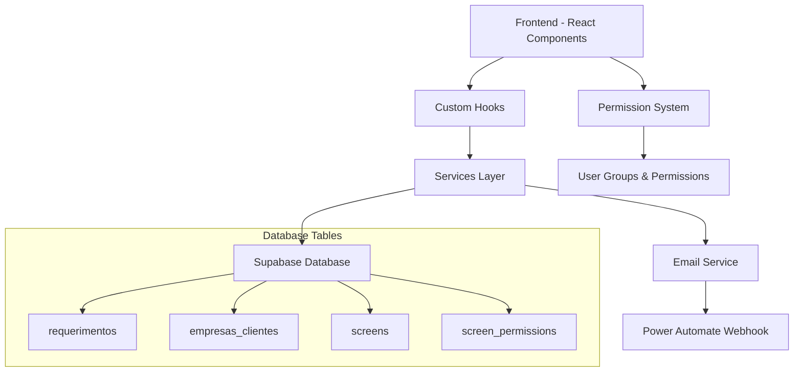
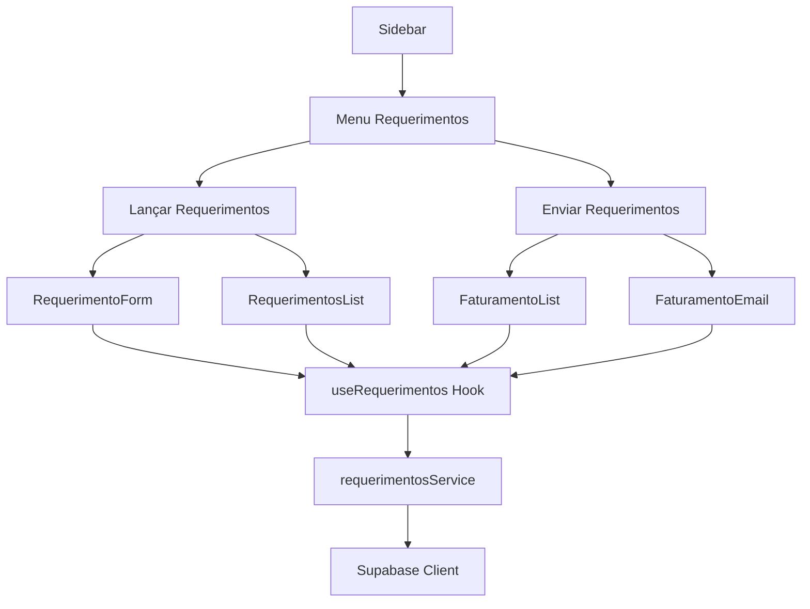

# Design Document

## Overview

O Sistema de Requerimentos é uma funcionalidade administrativa que permite o gerenciamento completo do ciclo de vida de especificações funcionais (EFs) de chamados técnicos. O sistema integra-se com a arquitetura existente do Books SND, utilizando React 18 com TypeScript, Supabase como backend, e seguindo os padrões estabelecidos de componentes, serviços e permissões.

## Architecture

### High-Level Architecture



### Component Architecture



## Components and Interfaces

### 1. Database Schema

#### Tabela: requerimentos
```sql
CREATE TABLE requerimentos (
  id UUID PRIMARY KEY DEFAULT gen_random_uuid(),
  chamado VARCHAR(50) NOT NULL,
  cliente_id UUID NOT NULL REFERENCES empresas_clientes(id),
  modulo VARCHAR(50) NOT NULL,
  descricao TEXT NOT NULL CHECK (length(descricao) <= 500),
  data_envio DATE NOT NULL,
  data_aprovacao DATE NOT NULL,
  horas_funcional DECIMAL(10,2) NOT NULL DEFAULT 0,
  horas_tecnico DECIMAL(10,2) NOT NULL DEFAULT 0,
  horas_total DECIMAL(10,2) GENERATED ALWAYS AS (horas_funcional + horas_tecnico) STORED,
  linguagem VARCHAR(50) NOT NULL,
  tipo_cobranca VARCHAR(50) NOT NULL,
  mes_cobranca INTEGER NOT NULL CHECK (mes_cobranca >= 1 AND mes_cobranca <= 12),
  observacao TEXT CHECK (length(observacao) <= 1000),
  status VARCHAR(20) NOT NULL DEFAULT 'lancado',
  enviado_faturamento BOOLEAN NOT NULL DEFAULT FALSE,
  data_envio_faturamento TIMESTAMP,
  created_at TIMESTAMP DEFAULT NOW(),
  updated_at TIMESTAMP DEFAULT NOW(),
  
  CONSTRAINT valid_chamado CHECK (chamado ~ '^[A-Za-z0-9\-]+$'),
  CONSTRAINT valid_modulo CHECK (modulo IN ('Comply', 'Comply e-DOCS', 'pw.SATI', 'pw.SPED', 'pw.SATI/pw.SPED')),
  CONSTRAINT valid_linguagem CHECK (linguagem IN ('ABAP', 'DBA', 'Funcional', 'PL/SQL', 'Técnico')),
  CONSTRAINT valid_cobranca CHECK (tipo_cobranca IN ('Banco de Horas', 'Cobro Interno', 'Contrato', 'Faturado', 'Hora Extra', 'Sobreaviso', 'Reprovado', 'Bolsão Enel')),
  CONSTRAINT valid_status CHECK (status IN ('lancado', 'enviado_faturamento', 'faturado'))
);

-- Índices para otimização
CREATE INDEX idx_requerimentos_cliente_id ON requerimentos(cliente_id);
CREATE INDEX idx_requerimentos_status ON requerimentos(status);
CREATE INDEX idx_requerimentos_mes_cobranca ON requerimentos(mes_cobranca);
CREATE INDEX idx_requerimentos_tipo_cobranca ON requerimentos(tipo_cobranca);
CREATE INDEX idx_requerimentos_created_at ON requerimentos(created_at);

-- Trigger para atualizar updated_at
CREATE OR REPLACE FUNCTION update_requerimentos_updated_at()
RETURNS TRIGGER AS $$
BEGIN
  NEW.updated_at = NOW();
  RETURN NEW;
END;
$$ LANGUAGE plpgsql;

CREATE TRIGGER trigger_update_requerimentos_updated_at
  BEFORE UPDATE ON requerimentos
  FOR EACH ROW
  EXECUTE FUNCTION update_requerimentos_updated_at();
```

### 2. TypeScript Types

```typescript
// types/requerimentos.ts
export interface Requerimento {
  id: string;
  chamado: string;
  cliente_id: string;
  cliente_nome?: string; // Join com empresas_clientes
  modulo: ModuloType;
  descricao: string;
  data_envio: string;
  data_aprovacao: string;
  horas_funcional: number;
  horas_tecnico: number;
  horas_total: number;
  linguagem: LinguagemType;
  tipo_cobranca: TipoCobrancaType;
  mes_cobranca: number;
  observacao?: string;
  status: StatusRequerimento;
  enviado_faturamento: boolean;
  data_envio_faturamento?: string;
  created_at: string;
  updated_at: string;
}

export type ModuloType = 'Comply' | 'Comply e-DOCS' | 'pw.SATI' | 'pw.SPED' | 'pw.SATI/pw.SPED';
export type LinguagemType = 'ABAP' | 'DBA' | 'Funcional' | 'PL/SQL' | 'Técnico';
export type TipoCobrancaType = 'Banco de Horas' | 'Cobro Interno' | 'Contrato' | 'Faturado' | 'Hora Extra' | 'Sobreaviso' | 'Reprovado' | 'Bolsão Enel';
export type StatusRequerimento = 'lancado' | 'enviado_faturamento' | 'faturado';

export interface RequerimentoFormData {
  chamado: string;
  cliente_id: string;
  modulo: ModuloType;
  descricao: string;
  data_envio: string;
  data_aprovacao: string;
  horas_funcional: number;
  horas_tecnico: number;
  linguagem: LinguagemType;
  tipo_cobranca: TipoCobrancaType;
  mes_cobranca: number;
  observacao?: string;
}

export interface FaturamentoData {
  requerimentos: Requerimento[];
  totais: {
    [key in TipoCobrancaType]: {
      quantidade: number;
      horas_total: number;
    };
  };
}

export interface EmailFaturamento {
  destinatarios: string[];
  assunto: string;
  corpo: string;
  anexos?: any[];
}
```

### 3. Color Scheme for Cobrança Types

```typescript
// utils/requerimentosColors.ts
export const COBRANCA_COLORS = {
  'Banco de Horas': {
    bg: 'bg-blue-100',
    border: 'border-blue-300',
    text: 'text-blue-800',
    badge: 'bg-blue-500'
  },
  'Cobro Interno': {
    bg: 'bg-green-100',
    border: 'border-green-300',
    text: 'text-green-800',
    badge: 'bg-green-500'
  },
  'Contrato': {
    bg: 'bg-gray-100',
    border: 'border-gray-300',
    text: 'text-gray-800',
    badge: 'bg-gray-500'
  },
  'Faturado': {
    bg: 'bg-orange-100',
    border: 'border-orange-300',
    text: 'text-orange-800',
    badge: 'bg-orange-500'
  },
  'Hora Extra': {
    bg: 'bg-red-100',
    border: 'border-red-300',
    text: 'text-red-800',
    badge: 'bg-red-500'
  },
  'Sobreaviso': {
    bg: 'bg-purple-100',
    border: 'border-purple-300',
    text: 'text-purple-800',
    badge: 'bg-purple-500'
  },
  'Reprovado': {
    bg: 'bg-slate-100',
    border: 'border-slate-300',
    text: 'text-slate-800',
    badge: 'bg-slate-500'
  },
  'Bolsão Enel': {
    bg: 'bg-yellow-100',
    border: 'border-yellow-300',
    text: 'text-yellow-800',
    badge: 'bg-yellow-500'
  }
} as const;
```

### 4. React Components Structure

#### RequerimentoForm Component
```typescript
interface RequerimentoFormProps {
  requerimento?: Requerimento;
  onSubmit: (data: RequerimentoFormData) => Promise<void>;
  onCancel: () => void;
  isLoading?: boolean;
}
```

#### RequerimentoCard Component
```typescript
interface RequerimentoCardProps {
  requerimento: Requerimento;
  onEdit: (requerimento: Requerimento) => void;
  onEnviarFaturamento: (id: string) => Promise<void>;
  isLoading?: boolean;
}
```

#### FaturamentoList Component
```typescript
interface FaturamentoListProps {
  requerimentos: Requerimento[];
  onDisparar: (data: EmailFaturamento) => Promise<void>;
  isLoading?: boolean;
}
```

## Data Models

### Requerimento Entity
- **Primary Key**: UUID auto-generated
- **Foreign Keys**: cliente_id → empresas_clientes.id
- **Computed Fields**: horas_total (horas_funcional + horas_tecnico)
- **Constraints**: 
  - chamado format validation (letters, numbers, hyphen)
  - enum validations for modulo, linguagem, tipo_cobranca
  - text length limits (descricao: 500, observacao: 1000)
  - mes_cobranca range (1-12)

### Relationships
- **Requerimento** → **EmpresaCliente** (Many-to-One)
- Integration with existing permission system through screens table

## Error Handling

### Custom Error Classes
```typescript
// errors/requerimentosErrors.ts
export class RequerimentoError extends Error {
  constructor(
    message: string,
    public code: string,
    public field?: string
  ) {
    super(message);
    this.name = 'RequerimentoError';
  }
}

export class RequerimentoValidationError extends RequerimentoError {
  constructor(field: string, message: string) {
    super(message, 'VALIDATION_ERROR', field);
    this.name = 'RequerimentoValidationError';
  }
}

export class RequerimentoNotFoundError extends RequerimentoError {
  constructor(id: string) {
    super(`Requerimento com ID ${id} não encontrado`, 'NOT_FOUND');
    this.name = 'RequerimentoNotFoundError';
  }
}
```

### Error Boundaries
- Utilize existing GlobalErrorBoundary
- Implement specific error handling for requerimentos operations
- Toast notifications for user feedback

## Testing Strategy

### Unit Tests
- **Services**: requerimentosService.test.ts
- **Hooks**: useRequerimentos.test.ts
- **Components**: RequerimentoForm.test.tsx, RequerimentoCard.test.tsx
- **Utils**: requerimentosValidation.test.ts

### Integration Tests
- **Database Operations**: CRUD operations with Supabase
- **Permission Integration**: Access control validation
- **Email Integration**: Faturamento email dispatch

### E2E Tests
- **Complete Flow**: Lançar → Enviar para Faturamento → Disparar Email
- **Permission Flow**: Admin access validation
- **Form Validation**: All field validations and constraints

## Security Considerations

### Permission Integration
- Register screens in permission system:
  - `lancar_requerimentos` (view, create, edit)
  - `faturar_requerimentos` (view, execute)
- Admin group automatic permissions
- RLS policies for data access control

### Data Validation
- Server-side validation for all inputs
- SQL injection prevention through parameterized queries
- XSS prevention through proper data sanitization
- File upload security (if attachments are added later)

### Audit Trail
- Track all CRUD operations
- Log faturamento dispatches
- Integration with existing audit system

## Performance Optimizations

### Database Optimizations
- Proper indexing strategy
- Query optimization for large datasets
- Pagination for list views
- Efficient joins with empresas_clientes

### Frontend Optimizations
- React Query for caching and synchronization
- Lazy loading for large lists
- Debounced search functionality
- Optimistic updates for better UX

### Caching Strategy
- Cache cliente options for form selects
- Cache requerimentos lists with proper invalidation
- Utilize existing clientBooksCacheService patterns

## Integration Points

### Existing Systems
- **Permission System**: Full integration with screens and user groups
- **Email Service**: Utilize existing emailService for faturamento dispatch
- **Sidebar Navigation**: Add new menu items with proper permission checks
- **Database**: Extend existing Supabase schema

### External Services
- **Power Automate**: Email dispatch through existing webhook
- **Excel Export**: Future enhancement for faturamento reports
- **PDF Generation**: Future enhancement for detailed reports

## Deployment Considerations

### Database Migration
- Create migration script for requerimentos table
- Add permission screens to existing system
- Update RLS policies
- Create necessary indexes

### Environment Variables
- No new environment variables required
- Utilize existing Supabase configuration
- Leverage existing email service configuration

### Rollback Strategy
- Database migration rollback scripts
- Component feature flags for gradual rollout
- Permission rollback procedures